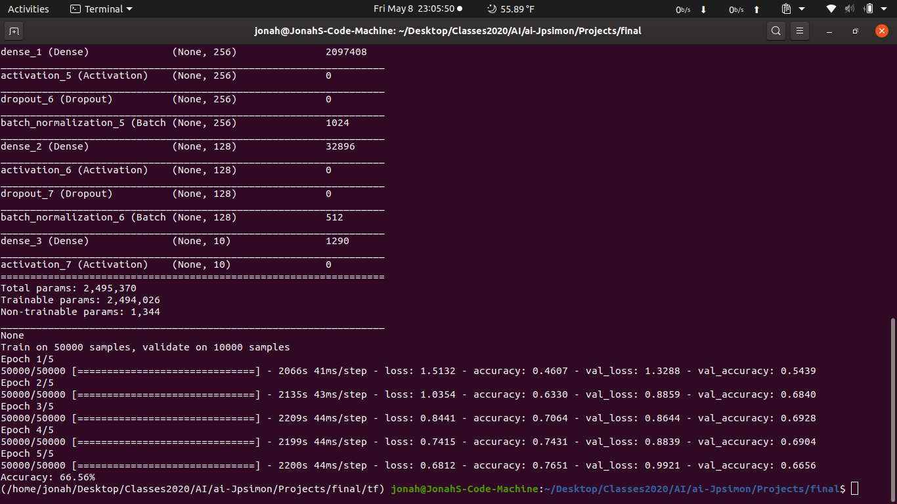

# Image Recognition AI using Tensorflow and Keras

## Three by three filter size with 5 epochs
### Accuracy: 74.71%

## Three by three filter size with another convolution layer and 10 epochs
### Accuracy: 81.20% 

## Four by four filter size with 5 epochs
### Accuracy: 78.85%

## Five by Five filter size with 5 epochs
### Accuracy: 66.56%

