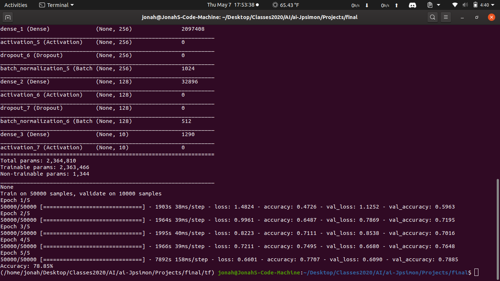

# Image Recognition AI using Tensorflow and Keras
### Accuracy: 74.71%
## Three by three filter size with 5 epochs

## Four by four filter size with 5 epochs
### Accuracy: 78.85%

## Four by Four filter size with 5 epochs
### Accuracy: 66.56%

